# CefGlue 学习指南

> **目标**：深入理解 CefGlue 的架构与实现原理，掌握 Avalonia 集成机制，达到能自主改造的程度。

---

## 一、项目概览

CefGlue 是一个 .NET 绑定库，用于将 Chromium Embedded Framework (CEF) 嵌入到 .NET 应用中。它通过 P/Invoke 调用 CEF 的 C API (`libcef`)，提供了面向对象的 C# 封装，并支持 **Avalonia** 和 **WPF** 两种 UI 框架的集成。

### 核心特点

| 特性 | 说明 |
|------|------|
| **P/Invoke 绑定** | 通过 `DllImport` 直接调用 `libcef.dll` 的 C API |
| **多进程架构** | Browser Process + Renderer Process 分离 |
| **双渲染模式** | Windowed (原生窗口) + OSR (离屏渲染) |
| **跨平台** | Windows / macOS / Linux |
| **UI 框架集成** | Avalonia (跨平台) + WPF (仅 Windows) |

---

## 二、仓库目录结构

```
CefGlue/                          # 仓库根目录
├── CefGlue/                      # 🔵 核心层：CEF C API 的 .NET P/Invoke 绑定
│   ├── CefRuntime.cs             #    CEF 运行时入口（加载、初始化、关闭）
│   ├── Interop/                  #    P/Invoke 声明层（libcef.g.cs 等自动生成）
│   │   ├── libcef.g.cs           #    自动生成的 DllImport 声明
│   │   ├── Base/                 #    基础互操作类型
│   │   ├── Classes.g/            #    自动生成的 CEF 类型结构
│   │   └── Structs/              #    CEF 结构体映射
│   ├── Classes.Handlers/         #    CEF Handler 抽象基类（CefClient, CefApp...）
│   ├── Classes.Proxies/          #    CEF 托管代理类（CefBrowser, CefFrame...）
│   ├── Classes.g/                #    自动生成的类
│   ├── Enums/                    #    CEF 枚举映射
│   ├── Structs/                  #    CEF 结构体映射
│   ├── Platform/                 #    平台特定代码
│   └── Wrapper/                  #    MessageRouter 等高级封装
│
├── CefGlue.Common/               # 🟢 公共适配层：框架无关的浏览器逻辑
│   ├── BaseCefBrowser.cs         #    浏览器控件基类（抽象 UI 框架差异）
│   ├── CommonBrowserAdapter.cs   #    浏览器适配器（Windowed 模式核心）
│   ├── CommonOffscreenBrowserAdapter.cs  # 离屏渲染适配器（OSR 模式核心）
│   ├── CommonCefClient.cs        #    CefClient 实现（事件分发中心）
│   ├── CefRuntimeLoader.cs       #    CEF 运行时加载器
│   ├── BrowserCefApp.cs          #    Browser 进程的 CefApp 实现
│   ├── Platform/                 #    平台抽象接口（IControl, IOffScreenControlHost）
│   ├── InternalHandlers/         #    内部 Handler 实现
│   ├── Handlers/                 #    用户可扩展的 Handler
│   ├── Events/                   #    事件参数定义
│   ├── JavascriptExecution/      #    JS 执行引擎
│   ├── ObjectBinding/            #    .NET <-> JS 对象绑定
│   └── Helpers/                  #    辅助工具类
│
├── CefGlue.Common.Shared/        # 🟡 共享层：Browser/Renderer 进程间共享代码
│   ├── RendererProcessCommunication/  # IPC 消息定义
│   ├── Serialization/            #    序列化工具
│   └── CustomScheme.cs           #    自定义 Scheme 定义
│
├── CefGlue.Avalonia/             # 🟣 Avalonia 集成层
│   ├── AvaloniaCefBrowser.cs     #    Avalonia 浏览器控件入口
│   ├── AvaloniaRenderSurface.cs  #    Avalonia 离屏渲染表面
│   ├── InputExtensions.cs        #    输入事件转换
│   ├── KeyInterop.cs             #    键盘映射
│   ├── CursorsProvider.cs        #    光标处理
│   └── Platform/                 #    平台实现
│       ├── AvaloniaControl.cs    #       Windowed 模式控件
│       ├── AvaloniaOffScreenControlHost.cs  # OSR 模式控件
│       ├── AvaloniaPopup.cs      #       弹出窗口
│       ├── Windows/              #       Windows 特定实现
│       ├── Linux/                #       Linux 特定实现
│       └── MacOS/                #       macOS 特定实现
│
├── CefGlue.WPF/                  # WPF 集成层（结构类似 Avalonia）
├── CefGlue.BrowserProcess/       # 🔴 Renderer 子进程可执行文件
│   ├── Program.cs                #    子进程入口点
│   ├── RendererCefApp.cs         #    Renderer 进程的 CefApp
│   └── ObjectBinding/            #    Renderer 侧对象绑定
│
├── CefGlue.Demo.Avalonia/        # Avalonia 示例应用
├── CefGlue.Demo.WPF/             # WPF 示例应用
├── CefGlue.Interop.Gen/          # Interop 代码生成器
└── CefGlue.Tests/                # 测试项目
```

---

## 三、整体架构图

### 3.1 分层架构

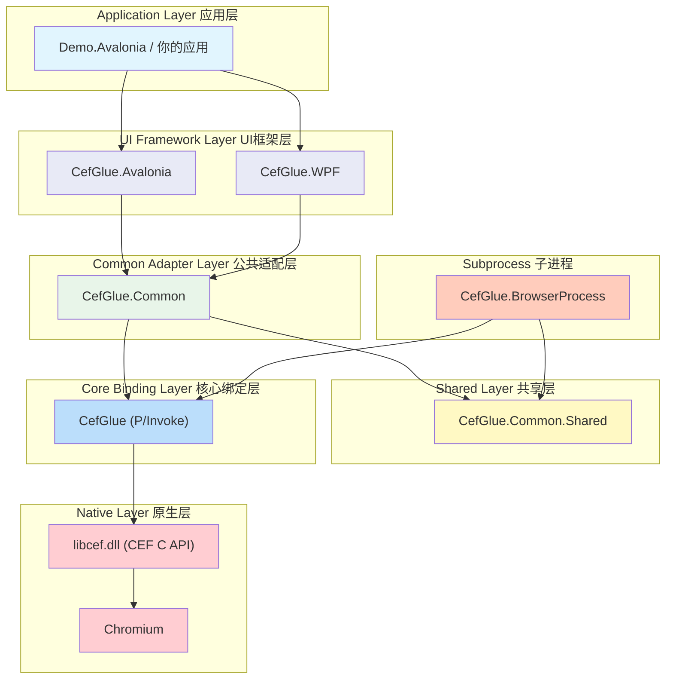

### 3.2 CEF 多进程架构

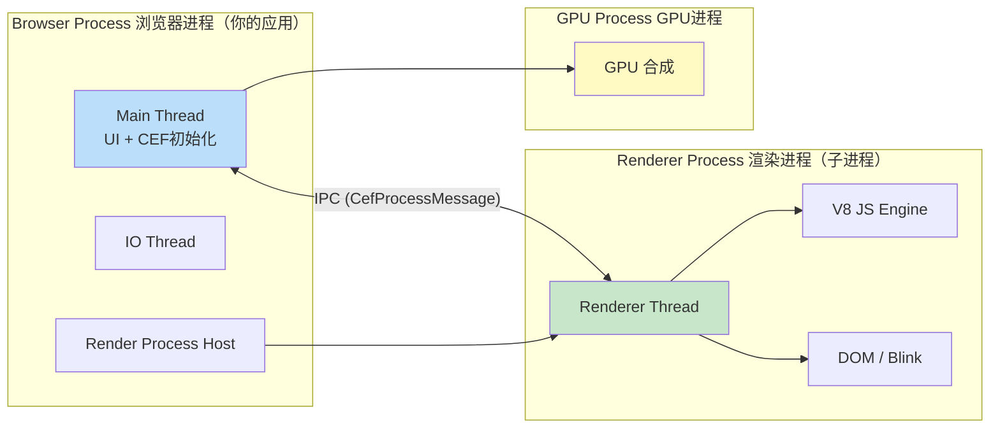

> **关键点**：CefGlue 的 `CefGlue.BrowserProcess` 项目就是这个 Renderer Process 的实现。主应用（Browser Process）通过设置 `BrowserSubprocessPath` 指定子进程路径。

### 3.3 类继承与组合关系

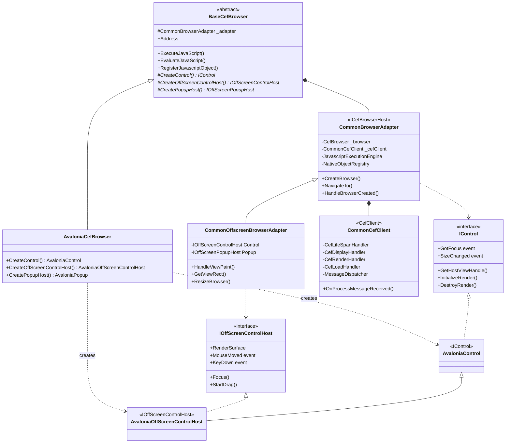

---

## 四、核心原理详解

### 4.1 P/Invoke 绑定机制

CefGlue 的核心是通过 P/Invoke 调用 CEF 的 C API。整个调用链：

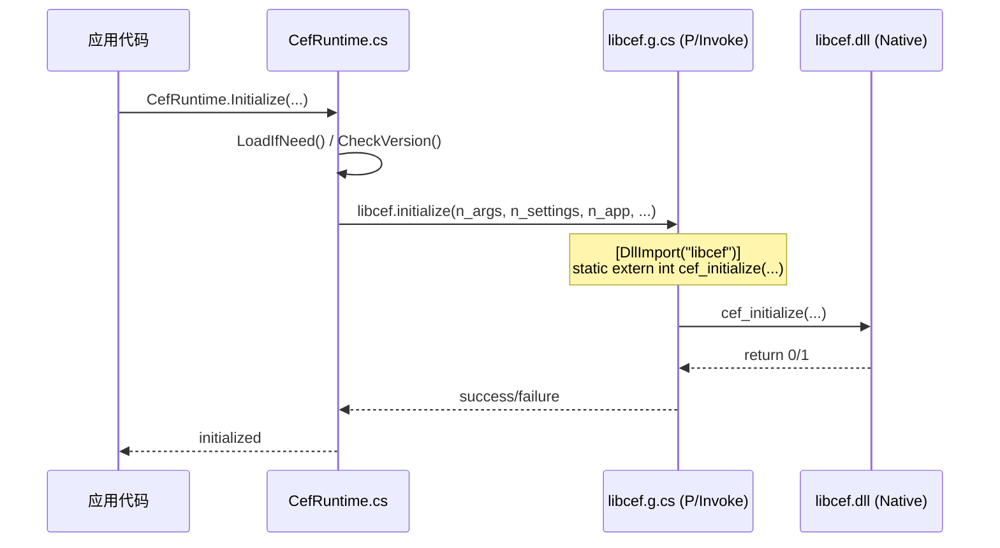

**关键文件**：
- `CefGlue/Interop/libcef.g.cs` — 自动生成的 `[DllImport]` 声明
- `CefGlue/CefRuntime.cs` — 封装了 CEF 全局函数调用
- `CefGlue/Interop/version.g.cs` — CEF 版本和 API Hash 检查

### 4.2 Handler 模式（回调机制）

CEF 通过 Handler 模式实现回调。CefGlue 将 C 函数指针回调转换为 C# 虚方法重写：

```mermaid
graph TB
    subgraph "CEF Native (C)"
        CEF_CLIENT["cef_client_t (C struct)<br/>内含函数指针"]
    end

    subgraph "CefGlue Core (Interop)"
        CEF_CLIENT_G["cef_client_t (C# struct)<br/>Marshal 映射"]
    end

    subgraph "CefGlue Handler (抽象层)"
        CEF_CLIENT_CS["CefClient (C# abstract class)<br/>virtual GetLifeSpanHandler()<br/>virtual GetDisplayHandler()<br/>..."]
    end

    subgraph "CefGlue.Common (实现层)"
        COMMON_CLIENT["CommonCefClient : CefClient<br/>override GetLifeSpanHandler()<br/>override GetDisplayHandler()<br/>..."]
    end

    CEF_CLIENT <-->|P/Invoke Marshal| CEF_CLIENT_G
    CEF_CLIENT_G <-->|Wrapper 转换| CEF_CLIENT_CS
    CEF_CLIENT_CS <|-- COMMON_CLIENT

    style CEF_CLIENT fill:#ffcdd2
    style CEF_CLIENT_G fill:#ffe0b2
    style CEF_CLIENT_CS fill:#bbdefb
    style COMMON_CLIENT fill:#c8e6c9
```

### 4.3 两种渲染模式

#### Windowed 模式（默认，Windows/Linux）

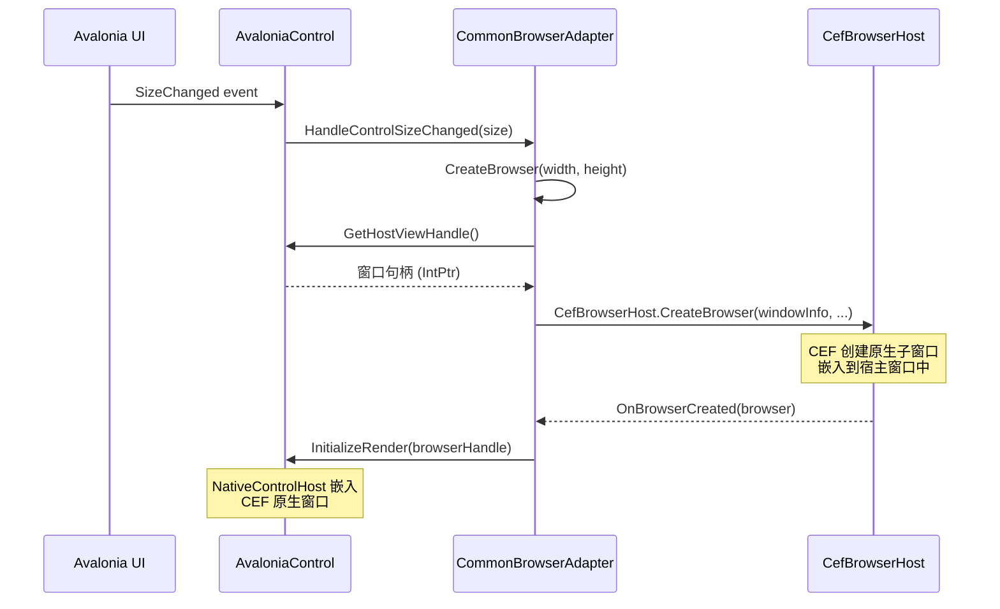

#### OSR 离屏渲染模式（macOS 必须，跨平台可选）

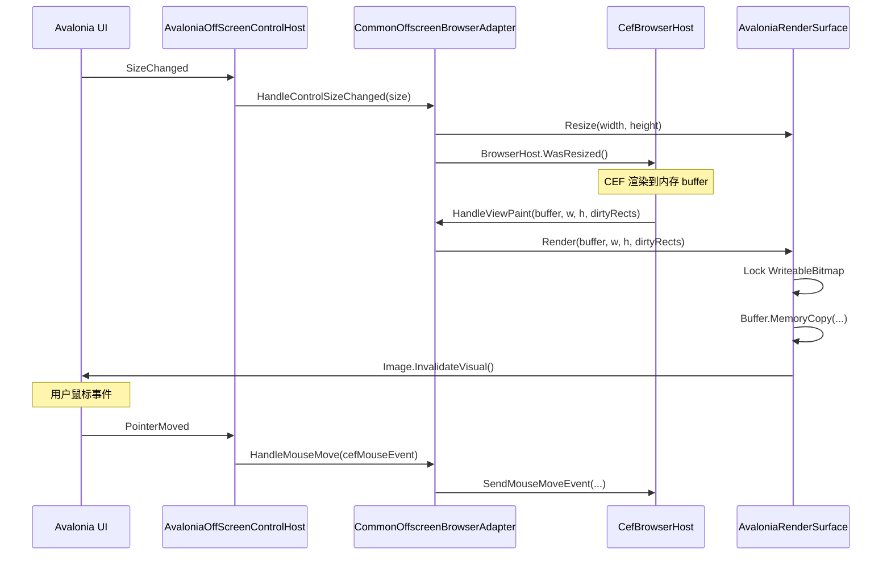

### 4.4 启动流程

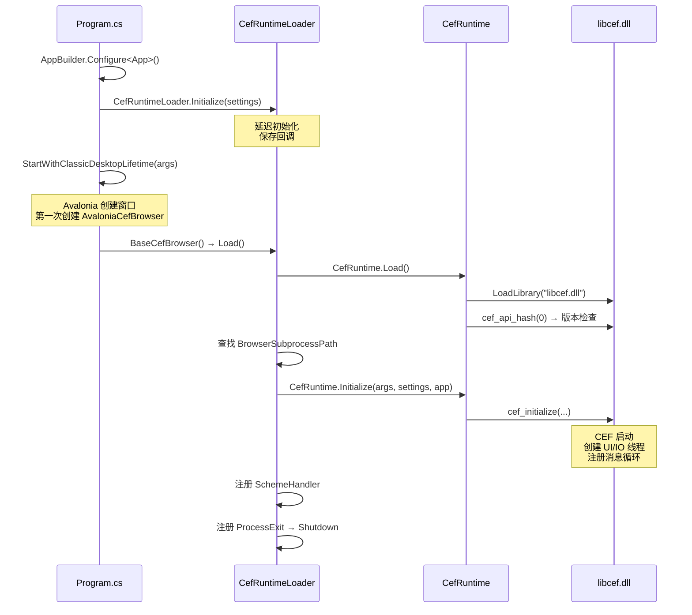

### 4.5 Browser 与 Renderer 进程通信

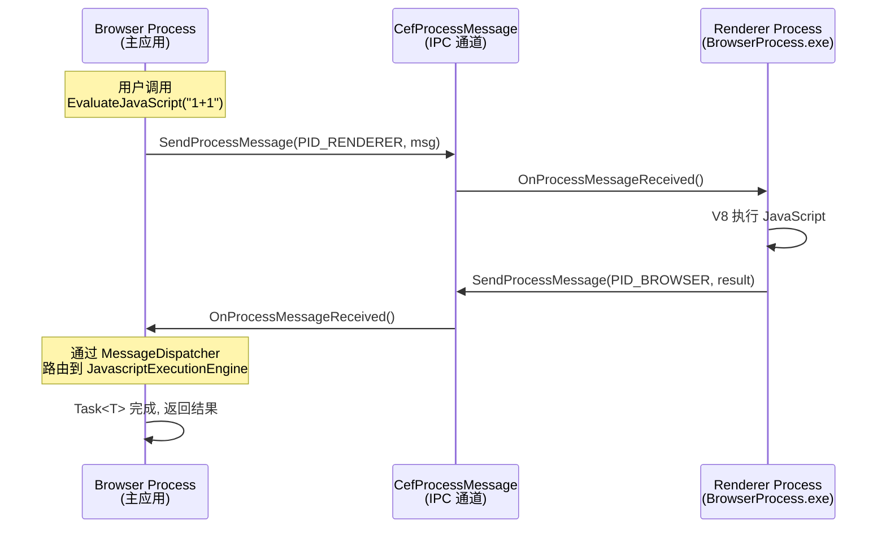

---

## 五、Avalonia 在 CefGlue 中的作用

Avalonia 在 CefGlue 中扮演 **UI 宿主** 的角色。具体职责：

### 5.1 职责划分

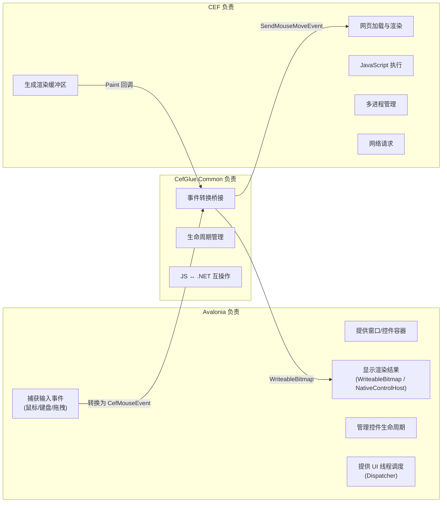

### 5.2 关键集成点

| 集成点 | Avalonia 实现类 | 作用 |
|--------|----------------|------|
| 控件容器 | `AvaloniaCefBrowser : BaseCefBrowser` | 浏览器控件入口 |
| 窗口嵌入 (Windowed) | `AvaloniaControl` → `NativeControlHost` | 将 CEF 原生窗口嵌入 Avalonia |
| 离屏渲染 (OSR) | `AvaloniaOffScreenControlHost` + `AvaloniaRenderSurface` | 通过 WriteableBitmap 显示 |
| 输入转换 | `InputExtensions.cs` + `KeyInterop.cs` | Avalonia 事件 → CEF 事件 |
| 光标处理 | `CursorsProvider.cs` | CEF 光标类型 → Avalonia Cursor |
| 弹出窗口 | `AvaloniaPopup` / `ExtendedAvaloniaPopup` | CEF 弹出菜单等 |

---

## 六、学习路线图

### 阶段一：基础理解（1-2天）

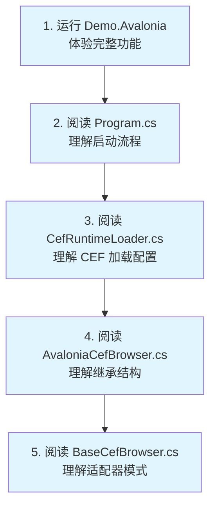

**阅读顺序**：

1. `CefGlue.Demo.Avalonia/Program.cs` — 应用启动、CEF 初始化
2. `CefGlue.Common/CefRuntimeLoader.cs` — CEF 运行时加载逻辑
3. `CefGlue.Avalonia/AvaloniaCefBrowser.cs` — Avalonia 入口控件
4. `CefGlue.Common/BaseCefBrowser.cs` — 公共浏览器基类
5. `CefGlue.Demo.Avalonia/BrowserView.axaml.cs` — XAML 中使用的方式

### 阶段二：适配层深入（2-3天）

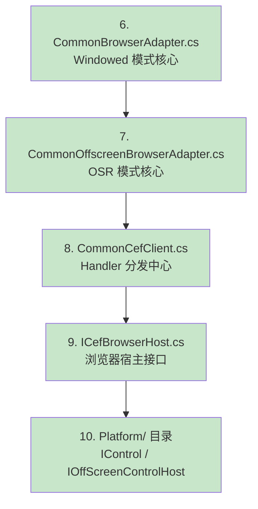

**重点理解**：
- `CommonBrowserAdapter.CreateBrowser()` — 浏览器创建流程
- `CommonBrowserAdapter.OnBrowserCreated()` — 浏览器就绪后的初始化
- `CommonOffscreenBrowserAdapter.HandleViewPaint()` — OSR 帧渲染
- `CommonCefClient` — 如何将 CEF 回调路由到 `ICefBrowserHost`

### 阶段三：Avalonia 集成层（2-3天）

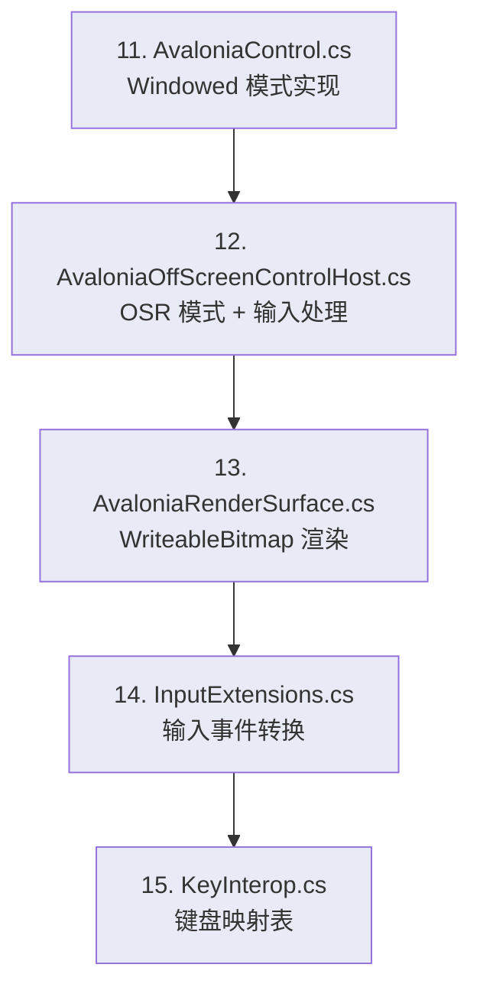

**重点理解**：
- `AvaloniaControl.GetHostViewHandle()` — 如何获取原生窗口句柄
- `AvaloniaControl.InitializeRender()` — NativeControlHost 嵌入
- `AvaloniaOffScreenControlHost` — 鼠标/键盘/拖拽事件 → CEF 事件
- `AvaloniaRenderSurface` — WriteableBitmap 的 Lock/Copy/Unlock 流程

### 阶段四：核心绑定层（3-5天）

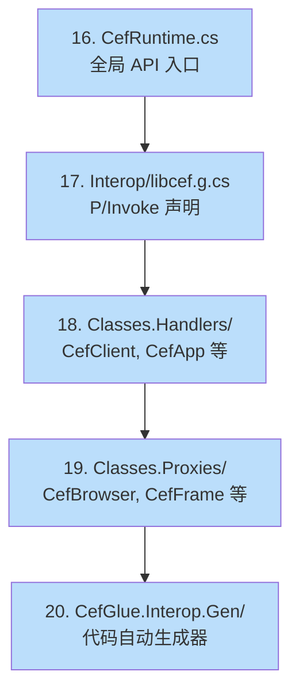

**重点理解**：
- `CefRuntime.Initialize()` — 参数转换 (managed → native) 的模式
- `unsafe` / `fixed` / 指针操作 — 与 C API 交互的核心技术
- Handler 的 `ToNative()` 方法 — 如何从 C# 对象创建 C 结构体
- Proxy（如 `CefBrowser`）的 `FromNative()` — 如何从 C 指针创建 C# 对象

### 阶段五：进程间通信（2-3天）

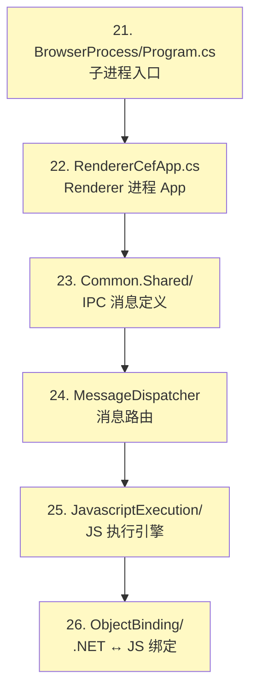

### 阶段六：实操改造（持续）

| 练习任务 | 涉及模块 | 难度 |
|----------|---------|------|
| 添加一个新的浏览器事件（如 favicon changed） | `ICefBrowserHost` + `CommonBrowserAdapter` + `BaseCefBrowser` | ⭐⭐ |
| 为 OSR 模式添加触摸事件支持 | `AvaloniaOffScreenControlHost` + `CommonOffscreenBrowserAdapter` | ⭐⭐⭐ |
| 实现自定义 CefSchemeHandler | `CustomScheme` + `CefResourceHandler` | ⭐⭐ |
| 新增 .NET 对象暴露给 JS 的方法 | `ObjectBinding/` | ⭐⭐⭐ |
| 支持一个新的 UI 框架（如 MAUI） | 参考 `CefGlue.Avalonia` 整层重写 | ⭐⭐⭐⭐⭐ |

---

## 七、关键设计模式

### 7.1 适配器模式 (Adapter)

`BaseCefBrowser` 使用 `CommonBrowserAdapter` 封装所有 CEF 交互，UI 框架层只需提供平台特定的控件实现。

```
BaseCefBrowser (抽象)          CommonBrowserAdapter (逻辑)
   ↓ 继承                          ↑ 组合
AvaloniaCefBrowser ───创建────→ AvaloniaControl (平台实现)
```

### 7.2 工厂方法模式 (Factory Method)

`BaseCefBrowser` 定义了三个抽象工厂方法，由具体 UI 框架子类实现：

```csharp
internal abstract IControl CreateControl();                     // Windowed 模式
internal abstract IOffScreenControlHost CreateOffScreenControlHost(); // OSR 模式
internal abstract IOffScreenPopupHost CreatePopupHost();        // 弹出窗口
```

### 7.3 策略模式 (Strategy)

根据 `WindowlessRenderingEnabled` 设置，选择 `CommonBrowserAdapter` 或 `CommonOffscreenBrowserAdapter`：

```csharp
// BaseCefBrowser 构造函数中
if (CefRuntimeLoader.IsOSREnabled)
    _adapter = new CommonOffscreenBrowserAdapter(...);  // OSR 策略
else
    _adapter = new CommonBrowserAdapter(...);           // Windowed 策略
```

### 7.4 代码生成模式

`CefGlue.Interop.Gen/` 项目自动生成 P/Invoke 绑定代码，保持与 CEF C API 的同步。

---

## 八、调试技巧

### 环境准备

```bash
# 1. 编译整个解决方案
dotnet build Xilium.CefGlue.sln

# 2. 运行 Avalonia Demo
dotnet run --project CefGlue.Demo.Avalonia
```

### 调试要点

1. **断点位置建议**：
   - `CefRuntimeLoader.InternalInitialize()` — CEF 初始化
   - `CommonBrowserAdapter.CreateBrowser()` — 浏览器创建
   - `CommonBrowserAdapter.OnBrowserCreated()` — 浏览器就绪
   - `CommonOffscreenBrowserAdapter.HandleViewPaint()` — 每帧渲染
   - `CommonCefClient.OnProcessMessageReceived()` — IPC 消息

2. **子进程调试**：
   - 在 `CefGlue.BrowserProcess/Program.cs` 的 `catch` 块中，Debug 模式下会调用 `Debugger.Launch()`
   - 也可以设置 `CefSettings.RemoteDebuggingPort = 9222` 启用 Chrome DevTools 远程调试

3. **日志查看**：
   - 设置 `CefSettings.LogSeverity` 和 `CefSettings.LogFile` 查看 CEF 内部日志

---

## 九、常见改造场景指引

### 场景1：拦截/修改网页请求

```
关键类: CefRequestHandler → CefResourceRequestHandler
文件: CefGlue/Classes.Handlers/CefRequestHandler.cs
路径: CommonBrowserAdapter.RequestHandler → CommonCefClient.GetRequestHandler()
```

### 场景2：注入 JavaScript / 与网页通信

```
关键类: JavascriptExecutionEngine, NativeObjectRegistry
文件: CefGlue.Common/JavascriptExecution/
     CefGlue.Common/ObjectBinding/
路径: BaseCefBrowser.ExecuteJavaScript() → adapter → frame.ExecuteJavaScript()
     BaseCefBrowser.RegisterJavascriptObject() → NativeObjectRegistry
```

### 场景3：自定义协议 (Scheme)

```
关键类: CustomScheme, CefSchemeHandlerFactory, CefResourceHandler
文件: CefGlue.Common.Shared/CustomScheme.cs
     CefGlue.Demo.Avalonia/CustomSchemeHandlerFactory.cs
路径: CefRuntimeLoader.Initialize(customSchemes: [...])
```

### 场景4：修改渲染方式

```
关键类: AvaloniaRenderSurface (OSR) / AvaloniaControl (Windowed)
文件: CefGlue.Avalonia/AvaloniaRenderSurface.cs
     CefGlue.Avalonia/Platform/AvaloniaControl.cs
关键方法: AvaloniaRenderSurface.UpdateBitmap() — 可替换为 GPU 纹理等
```

---

## 十、进一步阅读资源

- [CEF 官方文档 (C API)](https://bitbucket.org/chromiumembedded/cef/wiki/GeneralUsage)
- [CEF 架构概述](https://bitbucket.org/chromiumembedded/cef/wiki/Architecture)
- [Avalonia 文档 - NativeControlHost](https://docs.avaloniaui.net/docs/controls/nativecontrolhost)
- [P/Invoke 文档](https://learn.microsoft.com/en-us/dotnet/standard/native-interop/pinvoke)
- 本仓库 `CefGlue.Interop.Gen/` — 理解代码生成流程
